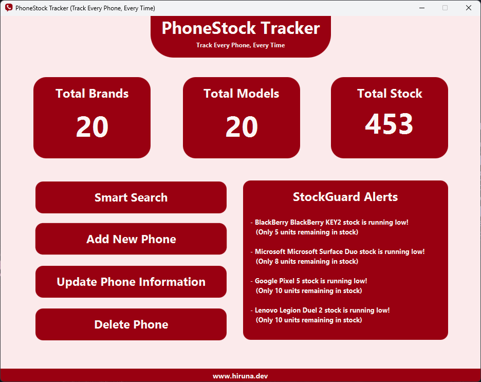

# PhoneStock Tracker


PhoneStock Tracker is a JavaFX application for efficiently managing phone inventory. It provides a user-friendly interface for adding, updating, deleting, and searching phone records stored in a MySQL database. This application aims to streamline inventory management processes for phone retailers or distributors.

## Features

- **Add Phone Records:** Easily add new phone records with detailed information such as brand, model, quantity, color, RAM, storage, and price.
- **Update Phone Records:** Update existing phone records to keep inventory data accurate and up-to-date.
- **Delete Phone Records:** Remove outdated or obsolete phone records from the database.
- **Search Functionality:** Search for specific phone records based on brand or model to quickly retrieve relevant information.
- **Statistical Analysis:** View statistics including total brands, total models, and total stock to gain insights into inventory trends.

## Technologies Used

- Java: Programming language used for the application logic.
- JavaFX: GUI toolkit for building the graphical user interface.
- MySQL: Relational database management system used for storing phone inventory data.

## Setup

1. **Clone the Repository:**
   ```bash
   git clone https://github.com/hirunaofficial/PhoneStock-Tracker.git
    ```


2. **Import Project**
    - Open the project in your preferred IDE (e.g., IntelliJ IDEA, Eclipse).
    - Ensure that the JavaFX SDK is correctly configured in your IDE.

3. **Database Setup**
    - Create a new MySQL database named `phone_stock_tracker`.
    - Run the SQL script `phone_stock_tracker.sql` located in the `database` directory to create the necessary tables and insert sample data.

4. **Configure Database Connection**
    - Update the database connection properties in the `DatabaseConfig` class located in the `src/main/java/com/phonetracker/config` directory.
    - Modify the `DB_URL`, `DB_USER`, and `DB_PASSWORD` fields with your MySQL database connection details.


## Usage

1. **Run the Application**
   - Run the `MainApp` class to start the application.
    - The main window of the PhoneStock Tracker application will be displayed.
    - The application provides the following options:
        - **Search Phone Record:** Search for a phone record based on brand or model.
        - **Add Phone Record:** Add a new phone record to the database.
        - **Update Phone Record:** Update an existing phone record in the database.
        - **Delete Phone Record:** Delete a phone record from the database.

- **Search Phone Record**
   - Click on the "Search Phone Record" button in the main window.
   - Enter the brand or model of the phone record to search for.

- **Add Phone Record**
    - Click on the "Add Phone Record" button in the main window.
    - Enter the details of the new phone record in the form.
    - Click the "Add Phone" button to add the phone record to the database.


- **Update Phone Record**
    - Click on the "Update Phone Record" button in the main window.
    - Click the "Update" button related to the phone record you want to update.
    - Update the details of the phone record in the form.
    - Click the "Update Phone" button to save the changes to the database.


- **Delete Phone Record**
    - Click on the "Delete Phone Record" button in the main window.
    - Click the "Delete" button to remove the phone record from the database.

## Screenshots




## Contributing Guidelines

Contributions are welcome! If you encounter any issues or have suggestions for improvements, please create a GitHub issue or submit a pull request.

## License Information

This project is licensed under the GNU General Public License v3.0 License - see the LICENSE file for details.

## Contact

- Author: Hiruna Gallage
- Website: [hiruna.dev](https://hiruna.dev)
- Email: [hello@hiruna.dev](mailto:hello@hiruna.dev)
